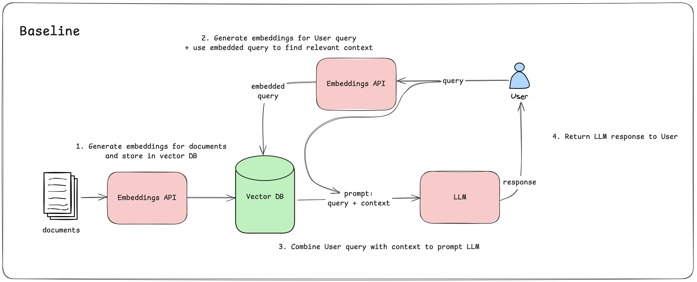
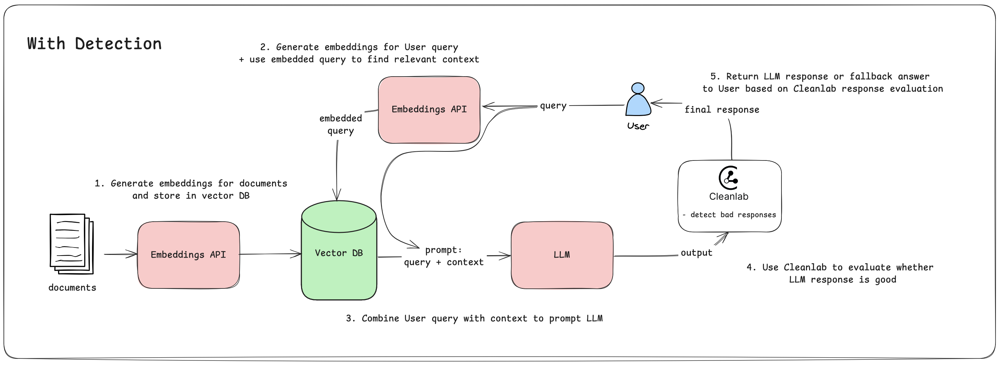
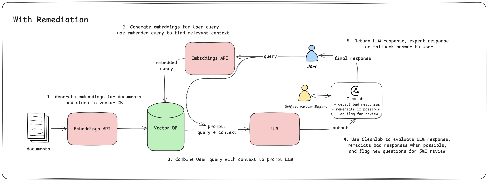

# From Prototype to Production: Bridging the AI Reliability Gap

Building a prototype AI application is easy, but getting it to work reliably in production is not. Just ask the developers of New York’s MyCity, whose AI got caught telling businesses to break the law. (And there are many other stories like this!) We envision a future where AI applications avoid such issues by design, using automated detection and remediation of bad responses. In this hands-on workshop, we’ll walk you through a case study of building a reliable retrieval-augmented generation (RAG) application. We’ll start by implementing a baseline application, then integrate Cleanlab’s automated real-time evaluations to detect general issues such as knowledge gaps and hallucinations as well as custom application-specific evaluation criteria, and finally add real-time remediation of these issues.

[Workshop @ AI User Conference 2025 - Developer Day](https://www.aiuserconference.com/session/from-prototype-to-production-bridging-the-ai-reliability-gap)
<br>
Presented by [Anish Athalye](https://www.linkedin.com/in/anishathalye/) and [Angela Liu](https://www.linkedin.com/in/angelaxliu/)
<br>
[Slides](https://docs.google.com/presentation/d/1-UQ2Ne16GpNmGXE9ezZ0aodSNQ-oRZEEwvLvjkrrJVc/edit?usp=sharing)

## Part 0: Prerequisites

At the start of this workshop, you'll need to set up a few things, including a development environment and some accounts/API keys.

### Development environment

This workshop supports both a local development environment and a Cloud-based development environment.

#### Local development

If you already have a local development environment set up with an IDE and the ability to install packages, we recommend that you use that.

We'll be using the [uv](https://docs.astral.sh/uv/) project and package manager for this workshop. You can install it by [following these instructions](https://docs.astral.sh/uv/getting-started/installation/) (and, e.g., installing it with your system package manager, like `brew install uv`).

#### Cloud-based development

If you don't have a local development environment set up, you can use a cloud-based development environment. We recommend using GitHub Codespaces (you get 60 hours of free usage with your GitHub account per month).

1. Fork this repository.
2. Open the repository in a Codespace.
3. Run `curl -LsSf https://astral.sh/uv/install.sh | sh` to install `uv`.

GitHub Codespaces supports everything you need to complete this workshop, including automatically forwarding ports when you `uv run ui.py` to let you use the UI for the RAG application.

### Accounts and API keys

This workshop uses Gemini for embeddings, TLM for real-time evaluation, and Codex for issue remediation. We'll explain all of these over the course of the workshop, but let's create the accounts and API keys up front.

Your API keys should go in a `.env` file; you can initialize it from the `.env.sample` file in this repository.

1. **Cleanlab accounts**: sign up for a Cleanlab account at [tlm.cleanlab.ai](https://tlm.cleanlab.ai/). After activating your account for TLM, you will also need to activate your account for [codex.cleanlab.ai](https://codex.cleanlab.ai/) (same account, you just need to activate both).
   1. Find your TLM API key in the [TLM dashboard](https://tlm.cleanlab.ai/) and save it in `.env` as `CLEANLAB_TLM_API_KEY`.
   2. Create a new Codex project, go to the Settings page, create an access key, and save it in `.env` as `CLEANLAB_CODEX_ACCESS_KEY`.
2. **Gemini API key**: sign up for a Gemini API key [Google AI Studio](https://aistudio.google.com/app/apikey) using your Google account.
   1. Create a new API key and save it in `.env` as `GOOGLE_API_KEY`.

### Testing the setup

To confirm that you've set environment variables correctly and that you've installed dependencies such as uv, run:

```console
$ uv run test_env.py
all ok
```

If you see any errors, please ask for help!

## Part 1: Implementing a baseline RAG application



### 1.1: Set up the knowledge base

For this part of the workshop, we'll be creating a knowledge base of documents from the [Cursor documentation](https://docs.cursor.com/). For convenience, we've included the scraped documents in the `example_data` directory of this codebase. We've also included a script to set up
a knowledge base from this directory. The script will load the markdown documents from `example_data/cursor_docs`, split them into smaller chunks (using a Markdown splitter), and populate a LlamaIndex in-memory VectorStoreIndex. It will then persist the VectorStoreIndex to disk in the `vector_store` directory to be used later in the workshop.

Run the script using `uv run create_knowledge_base.py example_data/cursor_docs`.

### 1.2: Implement the RAG system

Now that we have a knowledge base, we can implement a baseline RAG system that will answer customer support questions based on the Cursor support docs. This system will retrieve relevant context from the knowledge base and pass it to an LLM to generate a response that answers the user's question.

We've provided a skeleton implementation of the RAG system in the `rag.py` file. Your task is to implement a few methods to complete the system.

### 1.2a: Format the retrieved contexts

First, we'll implement the `_format_contexts` method. This method will take a list of retrieved context chunks and format them into a single string that can be passed to the LLM. See TODO Part 1.2a in `rag.py`.

### 1.2b: Format the final prompt

Next, we'll implement the `_format_prompt` method. This method will take the user's question and the formatted context chunks and format them into a single prompt that can be passed to the LLM. This method is used within the `_generate` method to format the final prompt passed to the LLM. See TODO Part 1.2b in `rag.py`.

### 1.2c: Query the RAG system

Finally, we'll implement the `_query` method. This method will take the user's question and use the `_retrieve` and `_generate` methods to query the RAG system and get an answer for the user's question based on relevant context. See TODO Part 1.2c in `rag.py`.

### 1.3: Test the baseline RAG system

You should now be able to run the RAG system using `uv run cli.py` which provides a CLI interface for the RAG system or `uv run ui.py` which provides a basic UI interface for the RAG system. Try out some questions to see if your system works! For inspiration, you can check out the questions in the `example_queries.md` file.

Note that the AI is nondeterministic, so you may get different responses each time you ask a question.

## Part 2: Detecting bad responses



Now that we have a baseline RAG system, we'll start adding some improvements on top of it. In this part, we'll focus on _detecting_ issues in the RAG system.

### 2.1: Add issue detection

We'll use the [Cleanlab Codex `Validator`](https://help.cleanlab.ai/codex/api/python/validator) class to detect issues in responses. Your `RAG` class should already have a `_validator` attribute that contains a `Validator` instance. Modify the `query` method of your `RAG` class to detect issues in the response using the [`_validator.validate` method](https://help.cleanlab.ai/codex/api/python/validator/#method-validate). See TODO Part 2.1 in `rag.py`.

### 2.2: Update response based on detected issues

Now that we've detected issues in the LLM response, we want to update the response object returned by the `query` method to include the detected issues. See TODO Part 2.2 in `rag.py`.

### 2.3: Test the RAG system with issue detection

We can now run the RAG system again using `uv run cli.py` or `uv run ui.py` to test our new system with issue detection! Try asking some questions and see if you can find any where issues are detected.

## Part 3: Remediating issues



Detecting issues is great, but ideally we want to _remediate_ them as well. [Cleanlab Codex](https://codex.cleanlab.ai) provides
an interface for Subject Matter Experts (SMEs) to contribute to remediation. When the Codex `Validator` detects an issue in a response, it will automatically add the question to the connected Codex project (that you created in Part 0). Your Subject Matter Experts can then review the question and provide a verified response. Then when your system encounters the same (or similar) question in the future, it will return the verified response instead of the LLM response.

### 3.1: Update the RAG system to handle expert answers

Update the `query` method of your `RAG` class to check if the response from `Validator` is an expert answer and update the returned metadata accordingly. See TODO Part 3.1 in `rag.py`.

### 3.2: Test the RAG system with issue remediation

Now that you've updated the `query` method to handle expert answers, you can try testing issue remediation. If you already found some questions in Part 2 with bad responses, you should see those questions in your Codex project. Otherwise, run the RAG system again using `uv run cli.py` or `uv run ui.py` and ask some questions to find some with bad responses.

Then navigate to the [Codex project](https://codex.cleanlab.ai/projects) you created earlier. You should see the questions you asked in the project. Put on your Subject Matter Expert hat and try answering some of the questions!

Now you return to the RAG system and try asking the same questions again. You should see that the RAG system now returns the expert answers instead of the LLM responses! You can also try asking questions that are similar to the ones you asked before, and you should see that the RAG system now returns the expert answers for those as well (If you do not get expert answers back, you can try adjusting the similarity threshold for your project in the [Codex UI](https://codex.cleanlab.ai/projects)).

## Part 4: Custom evaluations

So far, we've used the built-in set of evaluations provided by Cleanlab. For many applications, though, it may be helpful to customize the evaluations based on your specific use case. In this part, we'll walk through an example of including custom evaluations when validating responses in your system.

### 4.1: Add custom evaluations to your RAG system

Update your `RAG` implementation to include custom evaluations.

#### 4.1a: Define custom evaluations

Define a custom evaluation to include in your RAG system. See TODO Part 4.1a in `rag.py` for information on how to define custom evaluations and the format expected. Implement your solution there.

#### 4.1b: Update the RAG system to use your custom evaluations

Update your RAG system to use the custom evaluation you just defined. Be sure to set thresholds for you evalution as well. You may want to consider whether the custom evaluation should influence bad response detection for your system. It's possible to include an evaluation that does not contribute to issue detection by specifying a `bad_response_threshold` of 0. Implement your solution in TODO Part 4.1b in `rag.py`.

### 4.2: Test the RAG system with custom evaluations

Now that you've added custom evaluations to your RAG system, you can test it out again using `uv run cli.py` or `uv run ui.py`. Try asking some questions where you expect the custom evaluation scores to be high or low. If you included a custom evaluation that contributes to Validator's `bad_response_thresholds`, you should see that the RAG system now applies the remediation logic from Part 3 to those questions.

## Solutions

If you want to see fully-worked solutions for this workshop, you can check out the `solutions` directory.

To run the CLI/UI with the solutions, you can set the `USE_SOLUTION` environment variable appropriately. For example, run `USE_SOLUTION=custom_evals uv run ui.py` to run the UI with the custom evals solution.

## Resources

- [cleanlab.ai](https://cleanlab.ai/)
- [Documentation](https://help.cleanlab.ai/)
  - [Validator tutorial](https://help.cleanlab.ai/codex/tutorials/other_rag_frameworks/validator/) (covers detection, remediation, and custom evals)

## Next steps

If you're building agents, RAG, or chatbots that are in production, we'd love to talk to you! Get in touch with us at [cleanlab.ai/contact](https://cleanlab.ai/contact/).
