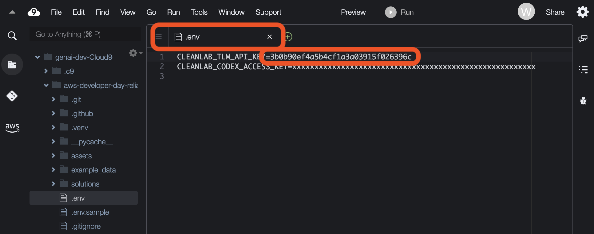
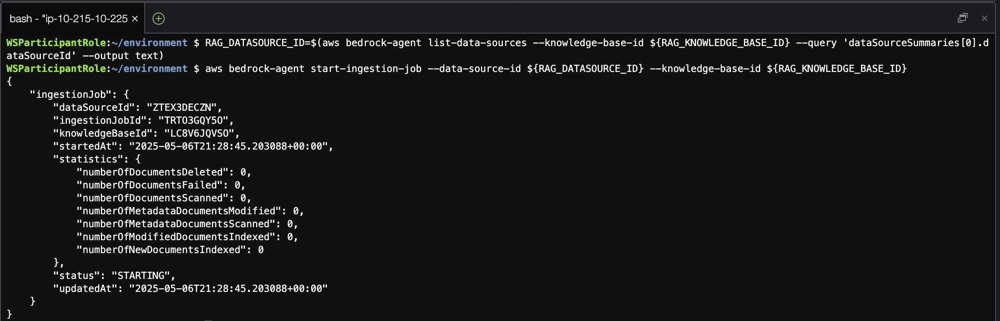
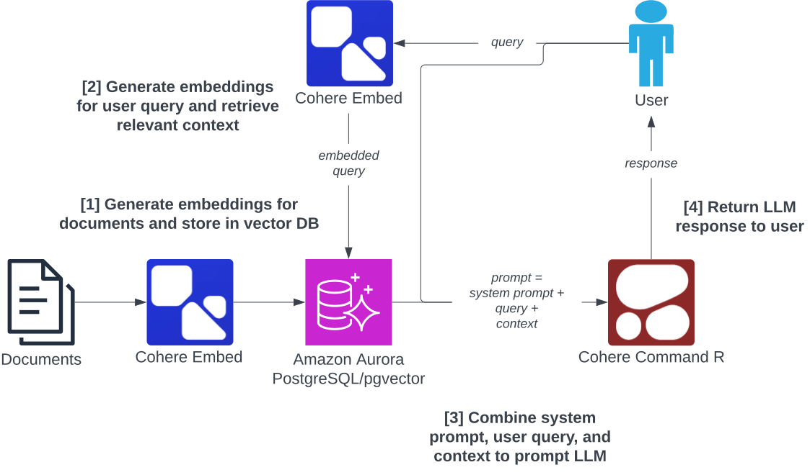

# From Prototype to Production: Bridging the AI Reliability Gap

Building a prototype AI application is easy, but getting it to work reliably in production is not. Just ask the developers of New York's MyCity, whose AI got caught telling businesses to break the law. (And there are many other stories like this!) We envision a future where AI applications avoid such issues by design, using automated detection and remediation of bad responses. In this hands-on workshop, we'll walk you through a case study of building a reliable retrieval-augmented generation (RAG) application. We'll start by implementing a baseline application, then integrate Cleanlab's automated real-time evaluations to detect general issues such as knowledge gaps and hallucinations as well as custom application-specific evaluation criteria, and finally add real-time remediation of these issues.

This workshop reproduces (and fixes!) [Cursor's rogue customer support AI](https://fortune.com/article/customer-support-ai-cursor-went-rogue/).

<p align="center">

</p>

---

[Data for Generative AI Workshop with AWS and Cleanlab](https://aws.amazon.com/startups/events/data-for-generative-ai-workshop-with-aws-and-cleanlabai) (Friday, May 9, 2025)
<br>
Presented by [Anish Athalye](https://www.linkedin.com/in/anishathalye/)
<br>
[Slides](https://docs.google.com/presentation/d/1dMYb3J2vF8pZGY--vwKRcLYlFjORdDEng14-WpcSN-U/edit?usp=sharing)

## Part 0: Prerequisites

At the start of this workshop, you'll need to set up a Cleanlab account, configure a Project, and save API keys.

For the entirety of this workshop, you will be using the Cloud9 IDE you set up earlier.

We'll set up Cleanlab accounts and projects first, but explain them in detail later as we go through the workshop.

### 0.1 TLM

Create a Cleanlab TLM account: go to [tlm.cleanlab.ai](https://tlm.cleanlab.ai), create an account, activate your trial, and confirm your email address.

Next, find and copy your API key:


We want to save this API key in the `.env` file in the Cloud9 IDE. First, configure Cloud9 to show hidden files by clicking on the gear icon in the file browser and selecting "Show Hidden Files":


Next, open up the `aws-developer-day-reliable-rag` directory, right click on the `.env.sample` file, and duplicate it:


Next, rename this file to `.env` by right clicking on it, selecting rename, and typing in the new name `.env`. Make sure to delete the original file extension; the file should be called just `.env`. Open up this file, add your TLM API key as `CLEANLAB_TLM_API_KEY`, and save the file:



### 0.2 Codex

Now, activate your Cleanlab account for [codex.cleanlab.ai](https://codex.cleanlab.ai/) (same Cleanlab account, you just need to activate Codex).

For this workshop, we will need a Codex project. Create a project by clicking on the "Create new" button:


Add a name (like "AWS Workshop"), leave the rest of the fields as-is, and click "Save":


Now, open up the settings for the newly-created project:


Create a new access key for the project:


Give the access key a name, leave the rest of the fields blank, and click "Create":


Copy the access key:


In Cloud9, save this access key in `.env` as `CLEANLAB_CODEX_ACCESS_KEY`:


Remember to save the file!

### 0.3: Sync the knowledge base

As part of the provisioning the infrastructure, we have created a knowledge base **kb-cleanlab** which is using an Amazon Aurora PostgreSQL database with the pgvector extension as the vector database. This knowledge base is connected to an S3 bucket which contains example data, but the knowledge base is not synced yet.

To sync the knowledge base, run the following command:

```bash
RAG_DATASOURCE_ID=$(aws bedrock-agent list-data-sources --knowledge-base-id ${RAG_KNOWLEDGE_BASE_ID} --query 'dataSourceSummaries[0].dataSourceId' --output text)
aws bedrock-agent start-ingestion-job --data-source-id ${RAG_DATASOURCE_ID} --knowledge-base-id ${RAG_KNOWLEDGE_BASE_ID}
```



### 0.4: Test the setup

To confirm that you've set environment variables correctly, run the test script.

Ensure the console is open:


Open a terminal:


Switch into the project directory with `cd aws-developer-day-reliable-rag` and run `uv run test_env.py`:


You should see the script print out `all ok`, confirming that your setup works!

## Part 1: Implementing a baseline RAG application



### 1.1: Implement the RAG system

We start by implementing a baseline RAG system that will answer customer support questions based on the Cursor support docs. This system will retrieve relevant context from the knowledge base and pass it to an LLM to generate a response that answers the user's question.

This workshop has already set up an AWS Bedrock Knowledge Base for you (using PostgreSQL/pgvector as the vector database) using the Cursor support docs as the content; a copy of the KB source material is available in [example_data](example_data/) for reference.

We've provided a partial implementation of the RAG system in the `rag.py` file. Start by familiarizing yourself with the provided code:


Your task is to implement a single method to complete the system: the `_query` method. This method will take the user's question and use the `_retrieve`, `_format_contexts`, and `_generate` methods to query the RAG system and get an answer for the user's question based on relevant context. See TODO Part 1.1 in `rag.py`.

### 1.2: Test the baseline RAG system

You should now be able to run the RAG system using `uv run cli.py` which provides a CLI interface for the RAG system or `uv run ui.py` which provides a basic UI interface for the RAG system. Try out some questions to see if your system works! For inspiration, you can check out the questions in the `example_queries.md` file.

Note that the AI is nondeterministic, so you may get different responses each time you ask a question.

For the CLI interface, you can interact with it directly in the terminal:


If you want to use the web-based interface, first run `uv run ui.py` to boot up the web server:


Next, open up a preview of the application:


The preview opens up in a small pane by default; you can drag the tab around, for example, merging it in with your main editor tabs, to make the preview larger. In this UI interface, you can ask questions to test your RAG system:


You might notice that this output is incorrect! Don't worry, we'll learn how to detect incorrect responses like this automatically in Part 2.

If you make changes to `rag.py`, you'll need to restart the CLI / web server. To interrupt / shut down the CLI or the web server, you can press ^C (Control-C):


## Part 2: Detecting bad responses


Now that we have a baseline RAG system, we'll start adding some improvements on top of it. In this part, we'll focus on _detecting_ issues in the RAG system.

### 2.1: Add issue detection

We'll use the [Cleanlab Codex `Validator`](https://help.cleanlab.ai/codex/api/python/validator) class to detect issues in responses. Your `RAG` class should already have a `_validator` attribute that contains a `Validator` instance. Modify the `query` method of your `RAG` class to detect issues in the response using the [`_validator.validate` method](https://help.cleanlab.ai/codex/api/python/validator/#method-validate). See TODO Part 2.1 in `rag.py`.

### 2.2: Update response based on detected issues

Now that we've detected issues in the LLM response, we want to update the response object returned by the `query` method to include the detected issues. See TODO Part 2.2 in `rag.py`.

### 2.3: Test the RAG system with issue detection

We can now run the RAG system again using `uv run cli.py` or `uv run ui.py` to test our new system with issue detection! Try asking some questions and see if you can find any where issues are detected:


**Note**: in a real-world use case, we wouldn't return a bad output to the user (as our demo app does for illustrative purposes); instead, we'd do something like returning a fallback answer (for example, "Sorry, I cannot answer that question at this time.") or escalating to a human.

## Part 3: Remediating issues


Detecting issues is great, but ideally we want to _remediate_ them as well. [Cleanlab Codex](https://codex.cleanlab.ai) provides
an interface for Subject Matter Experts (SMEs) to contribute to remediation. When the Codex `Validator` detects an issue in a response, it will automatically add the question to the connected Codex project (that you created in Part 0). Your Subject Matter Experts can then review the question and provide a verified response. Then when your system encounters the same (or similar) question in the future, it will return the verified response instead of the LLM response.

### 3.1: Update the RAG system to handle expert answers

Update the `query` method of your `RAG` class to check if the response from `Validator` is an expert answer and update the returned metadata accordingly. See TODO Part 3.1 in `rag.py`.

### 3.2: Test the RAG system with issue remediation

Now that you've updated the `query` method to handle expert answers, you can try testing issue remediation. If you already found some questions in Part 2 with bad responses, you should see those questions in your Codex project. Otherwise, run the RAG system again using `uv run cli.py` or `uv run ui.py` and ask some questions to find some with bad responses.

Then navigate to the [Codex project](https://codex.cleanlab.ai/projects) you created earlier. You should see the questions you asked in the project:


Put on your Subject Matter Expert hat and try answering some of the questions! Make sure to Publish your answer, so it starts affecting the output of the RAG system:


Now you return to the RAG system and try asking the same questions again. You should see that the RAG system now returns the expert answers instead of the LLM responses! You can also try asking questions that are similar to the ones you asked before, and you should see that the RAG system now returns the expert answers for those as well:


If you do not get expert answers back, you can try adjusting the similarity threshold for your project in the project settings in the Codex web app.

## Part 4: Custom evaluations

So far, we've used the built-in set of evaluations provided by Cleanlab. For many applications, though, it may be helpful to customize the evaluations based on your specific use case. In this part, we'll walk through an example of including custom evaluations when validating responses in your system.

### 4.1: Enable custom evaluations in your RAG system

Update your `RAG` implementation to include custom evaluations. See TODO Part 4.1 in `rag.py` to enable custom evaluations. This enables a custom evaluation that assesses whether a user question is related to a competitor.

Once you've added custom evaluations to your RAG system, you can test it out again using `uv run cli.py` or `uv run ui.py`. Try asking some questions where you expect the custom evaluation scores to be high or low.


### 4.2: Write your own custom evaluations

Define a custom evaluation to include in your RAG system. See TODO Part 4.2 in `rag.py` for information on how to define custom evaluations and the format expected. Implement your solution there.

For this custom evaluation, you'll be evaluating instruction adherence (does the RAG system follow instruction 1 in the `PROMPT_TEMPLATE` from `constants.py`?).

Once you've added this custom evaluation, re-run the system and try asking some questions where you expect the custom evaluation scores to be high or low. See `example_queries.md` if you need inspiration.


## Solutions

If you want to see fully-worked solutions for this workshop, you can check out the `solutions` directory.

To run the CLI/UI with the solutions, you can set the `USE_SOLUTION` environment variable appropriately (e.g., to "4" for the solution to part 4). For example, run `USE_SOLUTION=4 uv run ui.py` to run the UI with the custom evals solution.

## Resources

- [cleanlab.ai](https://cleanlab.ai/)
- [Documentation](https://help.cleanlab.ai/)
  - [Validator tutorial](https://help.cleanlab.ai/codex/tutorials/other_rag_frameworks/validator/) (covers detection, remediation, and custom evals)

## Next steps

If you're building agents, RAG, or chatbots that are in production, we'd love to talk to you! Get in touch with us at [cleanlab.ai/contact](https://cleanlab.ai/contact/).
